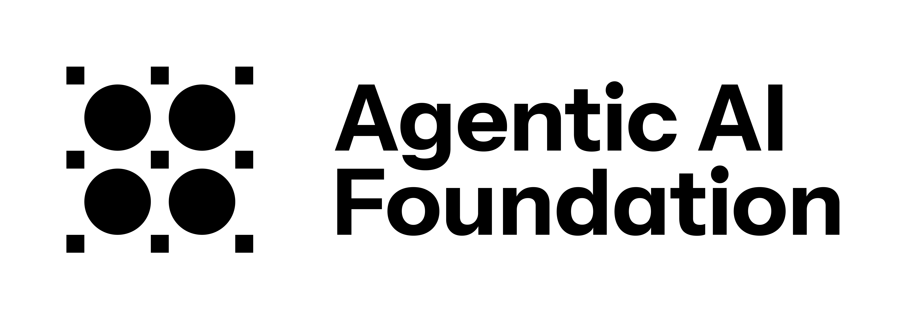
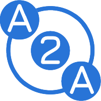

# Agentic AI Foundation

  

The Agentic AI Foundation (www.aaif.io) (AAIF) provides a neutral, open foundation to ensure this critical capability evolves transparently, collaboratively, and in ways that advance the adoption of leading open source AI projects. AAIF is part of the Linux Foundation (www.linuxfoundation.org).

## 🚀 Projects

<table>
  
  <tr>
    <td align="center">
      
    </td>
    <td>
      <a href="https://github.com/modelcontextprotocol">
        <strong>Model Context Protocol (MCP)</strong>
      </a>
    </td>
    <td>
      Impact Stage
    </td>
    <td>
      An open protocol that enables seamless integration between LLM applications and external data sources and tools.
    </td>
  </tr>

  <tr>
    <td align="center">
      
    </td>
    <td>
      <a href="https://github.com/aaif-goose">
        <strong>goose</strong>
      </a>
    </td>
    <td>
      Impact Stage
    </td>
    <td>
      An open source, extensible AI agent that goes beyond code suggestions. Install, execute, edit, and test with any LLM.
    </td>
  </tr>

  <tr>
    <td align="center">
      
    </td>
    <td>
      <a href="https://github.com/agentsmd">
        <strong>AGENTS.MD</strong>
      </a>
    </td>
     <td>
      Impact Stage
    </td>
    <td>
      A dedicated, predictable place to provide the context and instructions to help AI coding agents work on your project.
    </td>
  </tr>

  <tr>
    <td align="center">
      
    </td>
    <td>
      <a href="https://github.com/agentgateway">
        <strong>agentgateway</strong>
      </a>
    </td>
    <td>
      Growth Stage
    </td>
    <td>
      One high-performance gateway for service, LLM, and MCP traffic.
    </td>

  <tr>
    <td align="center">
      
    </td>
    <td>
      <a href="https://github.com/a2aproject">
        <strong>Agent2Agent (A2A)</strong>
      </a>
    </td>
    <td>
      An open standard for seamless communication and interoperability between AI agents
    </td>

  </tr>
</table>

## 💪 Working Groups

* [Identity and Trust](https://github.com/aaif/wg-identity-and-trust)
* [Governance, Risk, and Regulatory](https://github.com/aaif/wg-governance-risk-and-regulatory)
* [Workflows and Process Integration](https://github.com/aaif/wg-workflows-and-process-integration)
* [Accuracy and Reliability](https://github.com/aaif/wg-accuracy-and-reliability)
* [Security and Privacy](https://github.com/aaif/wg-security-and-privacy)
* [Agentic Commerce](https://github.com/aaif/wg-agentic-commerce)
* [Observability and Traceability](https://github.com/aaif/wg-observability-and-traceability)

## ⚙️ Cross-group Workstreams
* [Taxonomy and Landscape](https://github.com/aaif/ws-taxonomy-landscape)

